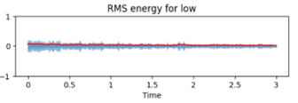
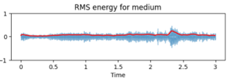
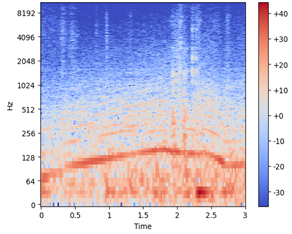
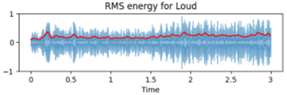
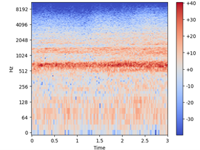
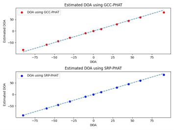

# TrafficSSL

## Acoustic detection and localization of noisy vehicles

## Brief Description
Collected vehicular traffic sound data via simulation, analyzed using signal processing tools (SNR, RMS,
zero-crossing rate, fast fourier transform, and spectograms). Designed a sound
source localization (SSL) system to detect and localize noisy cars and motorbikes on roads
using traditional techniques (GCC-PHAT, SRP-PHAT), and machine learning methods (SVM,
RF, RNN, LSTM).

## Sample Results

### Sound samples

#### Low

#### Medium

#### Loud

                                      
### Localization
Direction of arrival estimation;

